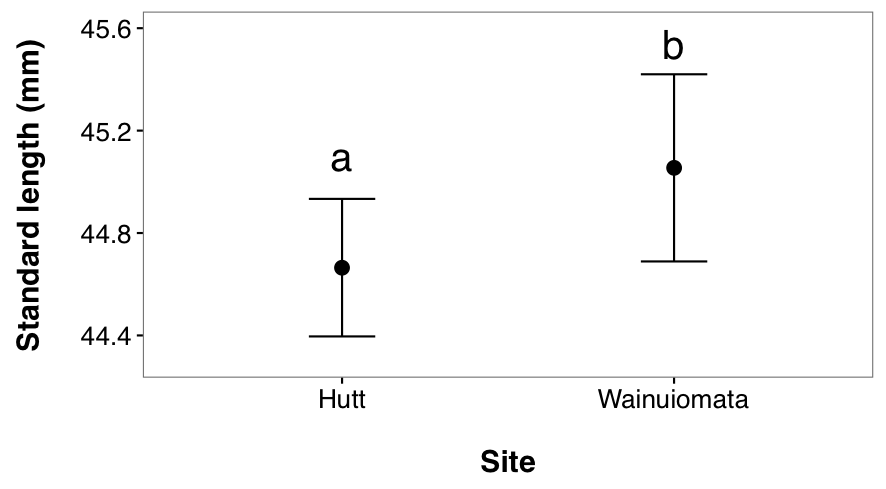
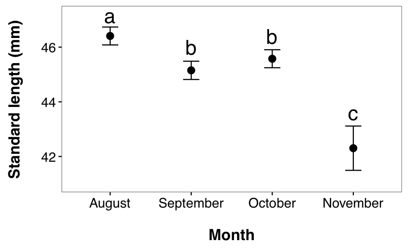

# Phenotypic Variation of Recruting *Galaxias Maculatus* Over Small Spatial and Temporal Scales

## Introduction

Recruitment is notoriously variable among fish populations, both in marine and freshwater systems (Houde 1994, Caley et al. 1996). While most studies focus on fluctuations in the abundance of recruits and their subsequent effects on year class strength (Hjort 1914, Houde and Hoyt 1987, Fogarty et al. 1991, Bailey 1994, Bjørnstad et al. 1999, Bastrikin et al. 2014), there is also extensive variation in the phenotype and developmental histories of these recruits (Houde 1989, Hadfield and Strathmann 1996, Searcy and Sponaugle 2000, Grorud-Colvert and Sponaugle 2006, Sponaugle et al. 2006). Fish populations also experience very high mortality during their early life stages (Dahlberg 1979, Bailey and Houde 1989, Sogard 1997, Chambers and Trippel 2012). Marine larvae will often disperse during their larval stage and settle away from their natal origin (Cowen and Sponaugle 2009). During this dispersal phase, individuals may experience highly fluctuating and unpredictable environments that can shape phenotypes, alter the expression of life histories, or ultimately die if they cannot adapt (Stearns 1992). Variation in phenotypes across populations may suggest local adaptation to a larval rearing environment (Harrod et al. 2010). Therefore, phenotype may be useful to infer dispersal patterns, developmental history and successful matches to environments encountered. 

Variation in phenotype can result from several different biological processes. Natural levels of genetic variation will produce distributions of phenotypic traits, which have varying levels of representation in the population (Shapiro et al. 2004). These traits may then be further influenced during ontogeny (Losos et al. 2000, Trussell and Smith 2000, Bergenius et al. 2005). For instance, variation in fitness-linked traits may lead to certain individuals experiencing higher levels of mortality than phenotypically different conspecifics (Searcy and Sponaugle 2001), which can reduce the frequency of the more susceptible phenotype. Several studies have demonstrated this selective mortality on variable life history traits, i.e. size and growth rate (Anderson 1988, Sogard 1997), and body condition (Buijse and Houthuijzen 1992, Hoey and McCormick 2004). Alternatively, environmental influences may cause some traits to show plasticity in response to conditions experienced by individuals. Phenotypic plasticity is well documented in fish, and phenotypes have been shown to be responsive to food availability (Günther et al. 2015), temperature (Fouzai et al. 2015), predation pressure (Kekalainen et al. 2010), and water flow (Imre et al. 2002). There is evidence that these early life experiences can shape an individual’s developmental trajectory and future success (i.e., carry-over effects) and therefore it is critical to understand the extent of variation in these early life histories (Shima and Findlay 2002). 

I chose to examine the recruitment dynamics of the amphidromous fish, Galaxias maculatus, a geographically widespread species native to New Zealand (McDowall 1968). After spending approximately six months developing in the open ocean, G. maculatus migrate to freshwater streams as metamorphosed juveniles (McDowall et al. 1994). During this migration, they can be caught just as they enter the mouth of the river. While they are known to migrate year round, peak spawning season is from March to June, and peak recruitment season is from August to November (McDowall et al. 1994). It is generally assumed that amphidromous species (and G. maculatus specifically) do not show high levels of natal homing, and therefore adult populations are made up of individuals originating from multiple natal origins (Fitzsimons et al. 1990, Radtke and Kinzie 1996, Waters et al. 2000, McDowall 2003, Hickford and Schiel 2016). Therefore, marine returning cohorts of G. maculatus are likely comprised of individuals of different natal origin and dispersal pathways. Due to spatial variation in environmental factors such as food availability and water temperature, fish with differing dispersal pathways may have experienced different environmental conditions during ontogeny (Moody et al. 2015). These conditions can result in phenotypic changes of fish if they have spent sufficient time in said environment (Chambers 1993). 

Recruitment is well known to vary over a range of spatial and temporal scales, both for G. maculatus (McDowall and Eldon 1980, McDowall 1994, Barbee et al. 2011), and in other fish species (Myers et al. 1997). However, comparatively few studies have addressed how variable G. maculatus recruitment might be over very small temporal (i.e., day to day) and spatial (i.e., <20 km) scales. The aim of this chapter was to investigate the extent of phenotypic variation among spatially and temporally discrete cohorts of recruiting juvenile G. maculatus. Specifically, I sampled juvenile fish in the peak recruitment season across two spatially unique sites through time, and measured individual traits (e.g., growth, size) known to be responsive to environmental variation. I hypothesized that I would find differences in phenotypes over larger temporal scales (i.e., month to month), but not over smaller temporal (i.e., day to day), or spatial scales. I analyse differences in developmental characteristics over these separate scales, and conclude with a discussion of potential causes and consequences of this variation. 


## Methods

### Fish Collections

I sampled juvenile Galaxias maculatus from two rivers in the Wellington region: the Hutt River and the Wainuiomata River (\@ref(fig:nzmap)). The two river mouths are spatially separated by approximately 20km (as the crow flies). The Hutt River empties into Wellington Harbour, which is a semi-sheltered, mixed, and productive environment (Maxwell 1956). In contrast, the Wainuiomata River empties into Cook Strait, which is more exposed, with fast flowing currents, and is less nutrient rich (Bowman et al. 1983). I collected fish on a monthly schedule between August and November 2015, fishing over a period of four consecutive days within each month (16 days total, both sites were sampled on each day). Each river was sampled simultaneously during fishing days to minimize temporal variability across sites. All fishing was conducted close to the river mouth (<500m inland for the Hutt River, <100m inland for the Wainuiomata). Standard gear used by whitebaiters generally consists of A-frame set nets (65 x 120 cm frame; 90 cm long; 2 mm mesh) or sock nets (75 x 113 cm frame; 220 cm long, 3 mm mesh). Set nets are suited for shallow rivers and correspondingly slow currents, while sock nets fish better in deep rivers with fast currents. For this reason I used two A-frame set nets in the Hutt River, placed within 1m of the riverbank, and one A-frame and one sock net in the Wainuiomata River. Nets were set approximately two hours before high tide, and fishing was conducted for approximately four hours. Local fisherman occasionally supplied samples onsite, which I used to supplement my own collections. Collected individuals were returned to the Victoria University Coastal Ecology Laboratory (VUCEL), euthanized in accordance with AEC permit 22038, and preserved in 99.9% ethanol for further analysis. 


### Evaluating Developmental Characteristics

I randomly sub-sampled daily catches for a target sample size of 30 fish per river per day for further analysis. I successfully caught fish on 15 separate days in the Hutt River, and 11 days in the Wainuiomata River. For days in which fewer than 30 fish were available I used all collected individuals (average sample size per day = 23 fish; 20 days had a sample size > 10 fish. During November, the Wainuiomata River was closed due to gravel build up, preventing juvenile G. maculatus from entering the river. Therefore, no samples were collecting during November in the Wainuiomata River. 

To estimate fish size I photographed each fish using an Olympus TG-3 camera with a reference ruler in the photo frame. Standard length measurements were obtained with ImageJ v1.49 (Schneider et al. 2012). I extracted the sagittal otoliths from each fish to measure age and growth history. I cleaned one otolith from each pair by placing it in a solution of 15% H2O2 buffered with NaOH for 16 hours. To expose daily growth rings I embedded the otoliths in resin, and polished them along the sagittal plane using a 3μm diamond lapping film. Otoliths were then photographed at either 200x or 400x magnification using a Canon EOS 70D camera connected to a Leica compound microscope. Between 2 and 5 photographs were taken of each otolith at slightly different focal planes (but with the same field of view) to expose all growth rings; photographs were then stitched together to make a composite image using GIMP v2.8.16 (GIMP Team 2016).

Composite images were analysed using the Otolith M app in Image-Pro Premier v9.1 (Media Cybernetics 2016). I counted the daily rings manually, and I measured the distance between each successive daily ring. I estimated ‘age’ as the number of daily rings, and average otolith growth rate as the length of the otolith radius divided by total number of daily rings. 

```{r, nzmap, echo=FALSE, fig.cap="Sampling locations for juvenile G. maculatus. Green = Hutt River. Red = Wainuiomata River. River mouths are approximately 20 km apart. Data for the maps comes from the ‘maps’ (Becker et al. 2016) and ‘mapdata’ (Becker et al. 2016) R packages."}

```


### Statistical Analysis

To evaluate spatio-temporal variation in G. maculatus developmental characteristics I fit three nested linear models (using standard length, average growth rate, and age as response variables in three separate models). Predictor variables included in each model were *site* (Hutt and Wainuiomata), *month* (4 months in the Hutt, 3 in the Wainuiomata), and *day* (4 days per month for each site). I included main effects of site, month, and day, and the interaction term of site x month. The day effect was nested within the interaction term as I only wanted to compare days that occurred within the same month and site. I hypothesized that all three response variables would show different patterns across months given divergent dispersal patterns and associated environmental conditions experienced. I did not expect to see any differences across days or between sites as I assumed larvae would all have experienced similar environmental conditions (or similar enough that differences would not be detectable). Therefore, I treated all terms in the model as fixed effects so I could specifically evaluate the differences between the levels of each factor. I conducted post hoc tests, using the ‘lsmeans’ procedure from the ‘lsmeans’ package (Lenth 2016), to evaluate 4 aspects of each model: Do developmental characteristics (1) vary between sites (main effect: site); and (2) vary across months (main effect: month). (3) Does the pattern of variation between sites differ across months (interaction: month x site). (4) Using the nested term I also evaluated variation in developmental characteristics across days within sites and months (nested main effect: day). When there was a significant interaction, I ran post hoc tests to evaluate aspects (1) and (2), see above. If there was no significant interaction, post hoc tests were run on each main effect. 


## Results

I evaluated spatial and temporal variation in developmental characteristics with a sample of 496 fish. Standard length ranged from 33.7 to 51.2mm (mean = 45.5, SD = 2.3). Ages ranged from 105 to 233 days (mean = 175, SD = 18.5). Otolith growth rates ranged from 1.27 to 2.25 μm-1day-1 (mean = 1.67, SD = 0.163).


### Spatio-temporal variation in standard length

I found a non-significant effect of the interaction term (F2, 470 = 1.95, p = 0.144, \@ref(fig:anova1)) suggesting that patterns of variation in length across months were similar between sites. Therefore I evaluated main effects. Fish from the Wainuiomata River were longer than fish from the Hutt River (main effect of site variable, F1, 470 = 10.74, p = 0.001, \@ref(fig:stdlengthsite)). 

```{r, anova1, echo=FALSE, fig.cap="Spatio-temporal variation in length, growth rate, and age of juvenile G. maculatus. “Site:Month” represents the interaction term, and “(Site:Month)/Day” represents the day term, nested within the month and site interaction term."}

```

```{r, stdlengthsite, echo=FALSE, fig.cap="Spatial variation in standard length of juvenile G. maculatus collected from two sites (Hutt River and Wainuiomata River). Given are L-S means (i.e. corrected for other sources of variation in the statistical model, see table 2-1) ± 95% CI. Dissimilar lowercase letters indicate a significant difference based upon post hoc tests."}

```

Length also varied across months (main effect of month variable, F3, 470 = 38.11, p < 0.001, \@ref(fig:stdlengthmonth)). A post hoc test revealed that fish caught in August were significantly larger than fish from September (p < 0.0001), October (p = 0.0026), and November (p < 0.0001). Fish from September and October were both significantly larger than November fish (p < 0.0001 for both) but not different from one another (p = 0.4505). 

```{r, stdlengthmonth, echo=FALSE, fig.cap="Temporal variation in standard length of juvenile G. maculatus collected from two sites. Given are LS means ± 95% CI. Dissimilar lowercase letters indicate a significant difference based upon post hoc tests."}

```

The standard length of G. maculatus varied significantly among days nested within sites (F19, 470 = 5.210, p < 0.0001, \@ref(fig:spatiotemp1)). A post hoc test (\@ref(fig:spatiotemp1table)) indicates that a small number of pairwise comparisons appear to be driving the significance of this effect. \@ref(fig:spatiotemp1) suggests that sizes of G. maculatus are heterogeneous across consecutive days within some months (i.e. October, November) for the Hutt River in particular.

```{r, spatiotemp1, echo=FALSE, fig.cap="Daily (within month) temporal variation in standard length between (A) Hutt River, and (B) Wainuiomata River. Given are LS means ± 95% CI. Different colours represent the different sampling days. Blue=day 1, orange=day 2, green=day 3, red=day 4. Missing symbols indicate days were no fish were sampled. Confidence intervals are obscured by size of symbols for several observations. Dissimilar lowercase letters indicate a significant difference based upon post hoc tests; separate analyses were conducted for each site and month. Sampling did not occur in the Wainuiomata River during November due to river mouth closure.}

```

```{r, spatiotemp1table, echo=FALSE, fig.cap="Pairwise comparisons of standard length between days nested within months and sites. No fishing was conducted in the Wainuiomata during November due to river mouth closure. No fish were successfully caught on the 1st day in August in the Wainuiomata or the 4th day in November in the Hutt (as indicated by “NA”). Asterisks indicate a significant difference in length between day pairs."}

```


### Spatio-temporal Variation in Average Growth Rate

I found a significant interaction between month and site (F2, 470 = 6.489, p = 0.0017, \@ref(fig:spatiotemporalgrowthrate)), indicating that growth rate changes over time and sites (\@ref(fig:anova1)). A post hoc test showed that, in the Hutt River, fish caught in August grew faster than fish caught in September (p < 0.0001), October (p = 0.0265) and November (p = 0.0134). September did not differ to October (p = 0.3105) or November (p > 0.9999). October and November also did not differ (p = 0.6749). In the Wainuiomata River, August fish did not have a significantly different growth rate to fish caught in September (p > 0.9999) or October (p = 0.3072). Fish from September and October also did not differ significantly (p = 0.5708).

```{r, spatiotemporalgrowthrate, echo=FALSE, fig.cap="Spatial and temporal variation in otolith growth rate of juvenile G. maculatus collected from two sites (circles/uppercase letters: Hutt River, triangles/lowercase letters: Wainuiomata River). Given are LS-means (i.e. corrected for other sources of variation in the statistical model (Table 2-1) ± 95% CI. Dissimilar letters indicate a significant difference within sites, across time (e.g., no difference across months within the Wainuiomata River). Sampling did not occur in the Wainuiomata River during November due to river mouth closure."}

```


The otolith growth rate varied significantly among days nested within months and sites  (F19, 470 = 5.2703, p < 0.0001, \@ref(fig:growthratebyday)). A post hoc test (Table 2 3) indicates that a small number of pairwise comparisons are driving the significance of this effect. \@ref(fig:growthratebyday) suggests that otolith growth rates of G. maculatus are heterogeneous across days within all months for the Hutt River and homogenous across days within all months for the Wainuiomata River. 

```{r, growthratebyday, echo=FALSE, fig.cap="The otolith growth rate varied significantly among days nested within months and sites  (F19, 470 = 5.2703, p < 0.0001, Figure 2 6). A post hoc test (Table 2 3) indicates that a small number of pairwise comparisons are driving the significance of this effect. Figure 2 6 suggests that otolith growth rates of G. maculatus are heterogeneous across days within all months for the Hutt River and homogenous across days within all months for the Wainuiomata River."}
knitr::include_graphics("images/growthratebyage.png")
```

```{r, spatiotemptable2, echo=FALSE, fig.cap="Pairwise comparisons of average otolith growth rate between days nested within months and sites. No fishing was conducted in the Wainuiomata during November due to river mouth closure. No fish were successfully caught on the 1st day in August in the Wainuiomata or the 4th day in November in the Hutt (as indicated by “NA”). Asterisks indicate a significant difference in length between day pairs."}

```

### Spatio-temporal Variation in Ages

I found a significant interaction between month and site (F2, 470 = 7.7421, p = 0.0004, \@ref(fig:spatiotemporalage)), indicating that patterns of age variation changed across time and sites. A post hoc test showed that, in the Hutt River, fish caught in August were significantly younger than fish caught in September (p < 0.0001), and October (p = 0.0029) but not November (p = 0.3783). Fish caught in September did not differ to fish from October (p = 0.4134) or November (p = 0.2774). There was also no difference in fish caught from October and November (p = 0.8869). In the Wainuiomata River, fish caught in August showed no difference in age to fish caught in September (p = 0.9934) or October (p = 0.7513). Fish caught in September also showed no difference to fish caught in October (p = 0.8709).

```{r, spatiotemporalage, echo=FALSE, fig.cap="I found a significant interaction between month and site (F2, 470 = 7.7421, p = 0.0004, Figure 2 7), indicating that patterns of age variation changed across time and sites. A post hoc test showed that, in the Hutt River, fish caught in August were significantly younger than fish caught in September (p < 0.0001), and October (p = 0.0029) but not November (p = 0.3783). Fish caught in September did not differ to fish from October (p = 0.4134) or November (p = 0.2774). There was also no difference in fish caught from October and November (p = 0.8869). In the Wainuiomata River, fish caught in August showed no difference in age to fish caught in September (p = 0.9934) or October (p = 0.7513). Fish caught in September also showed no difference to fish caught in October (p = 0.8709)."}

```

The ages of juvenile G. maculatus differed significantly among days nested within month and site (F19, 470 = 5.3537, p < 0.0001, \@ref(fig:spatiotemp3)). A post hoc test (\@ref(fig:spatiotemp3table)) again indicates that the significance of this effect is driven by a small number of pairwise comparisons in the Hutt River. \@ref(fig:spatiotemp3) suggests that ages of G. maculatus are heterogeneous across days within all months for the Hutt River and homogenous across days within all months for the Wainuiomata River.  

```{r, spatiotemp3, echo=FALSE, fig.cap="Daily (within month) temporal variation in age between (A) Hutt River, and (B) Wainuiomata River. Different colours represent the different sampling days. Blue=day 1, orange=day 2, green=day 3, red=day 4. Missing symbols indicate days were no fish were sampled. Error bars represent 95% confidence intervals. Confidence intervals are obscured by size of symbols for several observations. Dissimilar lowercase letters indicate a significant difference based upon post hoc tests; separate analyses were conducted for each site and month. Sampling did not occur in the Wainuiomata River during November due to river mouth closure."}

```

```{r, spatiotemp3table, echo=FALSE, fig.cap="Pairwise comparisons of average growth rate between days nested within months and sites. No fishing was conducted in the Wainuiomata during November due to river mouth closure. No fish were successfully caught on the 1st day in August in the Wainuiomata or the 4th day in November in the Hutt. Asterisks indicate a significant difference in length between a pair of days."}

```


## Discussion

### Summary of Results

I found site-specific trends in the developmental histories of G. maculatus. Juvenile G. maculatus entering the Wainuiomata River showed no difference in growth rate or age across months, although they did show a decrease in standard length across months. Fish from the Hutt River also shared this decrease in standard length, but also showed a decrease in otolith growth rate. Age showed a hump shaped curve, where the youngest recruiting fish were in August and November. Fish in the Hutt River during August, were the youngest, fastest growing, and largest, a pattern that was not reflected in the Wainuiomata. However, while fish from the Wainuiomata River did not show significant differences in otolith growth rate and age, there did appear to be non-significant trends that matched the results from the Hutt River. 

There was no day-to-day variation in any developmental characteristics of fish sampled from the Wainuiomata River. While fish from the Hutt River did show day-to-day variation, there was significant variation in the direction and magnitude of trends. Therefore, the two main points of interest become (1) why was there daily and monthly variation through time, and (2) why was there more variation in the Hutt River?


###	Spatial Differences in Developmental Histories

I propose two hypotheses that could explain my results (and these are not mutually exlusive): (1) the Hutt River may be replenished by fish from a wider variety of source populations than the Wainuiomata River, which could lead to greater variation in developmental histories among cohorts (natal source hypothesis), and/or (2) recruits from the Hutt River may have experienced greater environmental variability during their pelagic larval dispersal phase, which could lead to different phenotypic distributions through individual fish experiencing phenotypic plasticity or selective mortality (environmental experience hypothesis). 

A difference in the composition of source populations entering each river is dependent on the extent of dispersal. G. maculatus have very strong swimming capabilities (Barker and Lambert 1988), and considerable research has examined the extent of population mixing and natal return (Barker and Lambert 1988, Berra et al. 1996, Waters and Burridge 1999, Waters et al. 2000) with current paradigms suggesting that G. maculatus does not show extensive natal homing (Waters et al. 2000, Hickford and Schiel 2016). However most evidence is based off a lack of genetic structure among sampled populations, and genetic structuring may be mediated by only a small number of mixing individuals (Hartl 1988). Furthermore, most studies have been concerned with broad spatial hypotheses (Barriga et al. 2007, Barbee et al. 2011, Barriga et al. 2012), rather than considering the characteristics of individual systems that may facilitate a higher level of retention than the majority of source populations. Harbour systems have been shown to have highly retentive properties due to physical and hydrodynamic processes acting on the water currents (Maxwell 1956, Bowman et al. 1983, Anderson 1988). Therefore I suggest that the hydrodynamic characteristics of the Wellington Harbour may promote higher retention of larval G. maculatus than would be expected by a coastally positioned system, thus promoting self recruitment (Jones et al. 2005, Levin 2006, McDowall 2009). However, I do not assume that the Wellington Harbour is completely isolated from other (perhaps coastally derived) G. maculatus populations, and I would expect it to still receive input from other source populations around New Zealand (McDowall et al. 1975, Caley et al. 1996, McDowall 2002, Swearer et al. 2002). The combined input of recruits from other source populations (with their own variations in phenotype), plus the resident population in the Wellington Harbour, may combine to produce a more heterogeneous population of G. maculatus (Shima and Swearer 2009). Fish from the Wellington Harbour would therefore show a wider distribution in phenotypes than the Wainuiomata River, which may not have a resident population, and is only replenished by regional source populations (that shared more similar environmental conditions). These differences in the spread of potential phenotypes may be driving the lack of significant differences in the Wainuiomata, while accounting for the range of patterns documented in the Hutt River. 

Marine habitats can show considerable variation in temperature, water flow, light availability, and salinity (Johnston 2006) which may vary extensively through time. Pelagic fish may experience phenotypic plasticity as a result of this environmental variability, and therefore their phenotype may correlate with conditions experienced during dispersal. If my two study sites are replenished by different combinations of source populations, with differing dispersal histories, then the environmental conditions experienced may be driving these site specific differences. During dispersal, cohorts may encounter novel environments that impose directional selection on phenotypic traits (Reznick and Ghalambor 2001, Grether 2005), which shifts the mean phenotype to a new peak (Lande and Arnold 1983). Environmental pressures may be either biotic (Handelsman et al. 2013) or abiotic (Carrera et al. 2012) but all have the potential to drive phenotypic shifts (Agrawal 2001). This hypothesis is dependent upon Wellington Harbour showing a higher degree of temporal variability in its biotic and abiotic conditions. Under the assumption that it is more variable, individuals with recent resident periods in the harbour may have experienced phenotypic plasticity, and therefore developed phenotypic characteristics representative of the conditions at the time (Agrawal 2001, Barriga et al. 2012, Chapman et al. 2015). Depending on the scale of this variability it may account for both monthly and daily differences. In contrast, if the Cook Strait shows a less temporally variable environment then that may explain the fairly consistent trends in phenotypes of recruits. 

General trends in harbour systems have shown evidence of circulation currents leading to high levels of nutrients (Mackas and Harrison 1997) and zooplankton (Soetaert and Herman 1994). They have also shown that abiotic conditions can be highly variable between seasons (Muylaert and Raine 1999). Results by Maxwell (1956) indicate average water temperatures in the Wellington Harbour increase from August to November, yet there is also considerable fluctuation over shorter time scales, with changes of up to 2.5°C within a three day period. Maxwell (1956) also postulated that the causes of this high variability was due to the sheltered positioning of the harbour. In contrast, Cook Strait has very high energy, fast flowing currents (Bowman et al. 1983), and its lack of shelter may not promote high levels of abiotic variability. Cook Strait is highly dynamic with complex patterns of water circulation, but there is little evidence for its low productivity waters being temporally variable (Bowman et al 1983). While it may be a high energy environment, I argue that the consistent nature of it is not enough to drive phenotypic differences in resident cohorts of G. maculatus. 

